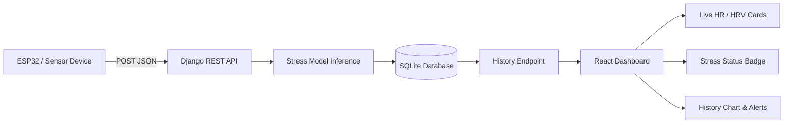

# Phase-I Synopsis: NeuroPlay

## 1. Project Title
**NeuroPlay: An AIoT-based Stress Monitoring System for Competitive Gaming**

## 2. Abstract
NeuroPlay is a full-stack AIoT prototype that receives live physiological readings from a sensor device such as an ESP32, predicts the user's stress level using a trained machine learning model, stores each reading in a Django database, and displays the latest status on a React dashboard. The system is designed for competitive gaming environments where low-latency feedback and clear visual alerts are important.

## 3. System Architecture
NeuroPlay follows a simple three-layer architecture:

- **IoT/Data Source Layer**: ESP32 or another sensor device sends heart rate, HRV, and RMSSD values.
- **Backend Layer**: Django REST API validates the payload, runs inference using the saved model, and stores the result in SQLite.
- **Frontend Layer**: React dashboard polls the backend regularly and updates live cards, history chart, and alerts.



### Backend Components
- **Django + Django REST Framework** for API development.
- **StressLog model** to store HR, HRV, RMSSD, predicted stress level, and timestamp.
- **Inference module** to load `stress_model_final.pkl` and predict stress labels.
- **History API** to return the latest sensor records for the dashboard.
- **CSV import support** for bulk loading test or historical data.
- **Django Admin** support for inspecting and managing records.

### Frontend Components
- **React + Vite** application.
- **Recharts** line chart for stress history over the last 30 minutes.
- **Live metrics cards** for HR and HRV.
- **Color-coded stress badge** for Normal, Moderate, and High states.
- **Toast / modal alerts** for stress warnings.
- **Polling-based refresh** every 3.5 seconds for live updates.

## 4. Setup Steps

### 4.1 Backend Setup
1. Open a terminal in the project root.
2. Create and activate a Python virtual environment.
3. Install dependencies.
4. Run migrations.
5. Start the Django server.

```bash
python -m venv .venv
.venv\Scripts\activate
pip install -r requirements.txt
python backend/manage.py makemigrations
python backend/manage.py migrate
python backend/manage.py runserver 127.0.0.1:8000
```

### 4.2 Frontend Setup
1. Open a second terminal in the `frontend` folder.
2. Install the frontend packages.
3. Start the Vite development server.

```bash
cd frontend
npm install
npm run dev
```

### 4.3 Live Sensor Connection
Send live readings from the ESP32 to:

- `POST http://127.0.0.1:8000/api/sensor-data/`

The payload must include:

```json
{
  "hr": 92,
  "hrv": 48.6,
  "rmssd": 31.2
}
```

The dashboard reads from:

- `GET http://127.0.0.1:8000/api/history/?limit=500`

The frontend automatically polls this endpoint every 3.5 seconds, so new sensor readings appear without manual refresh.

## 5. Functional Workflow
1. The wearable sensor measures HR, HRV, and RMSSD.
2. The device sends the values as JSON to the backend API.
3. Django validates the request and runs the stress prediction model.
4. The result is stored in the `StressLog` table.
5. The React dashboard fetches the latest history and updates the visual status.
6. If stress is Moderate or High, the interface shows a warning banner or modal.

## 6. Results Achieved in Phase-I
The following outcomes were completed during Phase-I:

- Built a working Django REST API for live sensor ingestion.
- Integrated `stress_model_final.pkl` for stress classification.
- Stored each reading in the database with timestamp and predicted stress level.
- Added a history endpoint for dashboard consumption.
- Built a React dashboard with live cards, charts, and alerts.
- Enabled automatic refresh using polling.
- Verified the full backend and frontend build pipeline successfully.
- Confirmed live dashboard rendering through browser testing.

### Validation Summary
- Backend tests passed: `python manage.py test stress_monitor`
- Frontend build passed: `npm run build`
- Dashboard verified with live sensor-style data and stress alerts

## 7. Tools and Technologies
- **Frontend**: React, Vite, Recharts
- **Backend**: Django, Django REST Framework
- **Database**: SQLite
- **Machine Learning**: Joblib, scikit-learn model bundle
- **IoT Integration**: ESP32 / HTTP JSON requests
- **Styling**: Custom CSS with a dashboard-focused UI

## 8. Conclusion
Phase-I delivered the core NeuroPlay pipeline from live sensor input to dashboard visualization. The system now accepts sensor readings, predicts stress level, stores results, and displays real-time status for competitive gaming use.

## 9. Future Scope
- Replace polling with WebSockets or Server-Sent Events for true push updates.
- Add authentication and device-level security for production deployment.
- Expand analytics with longer history ranges and performance trends.
- Support more wearable sensors and additional physiological signals.
